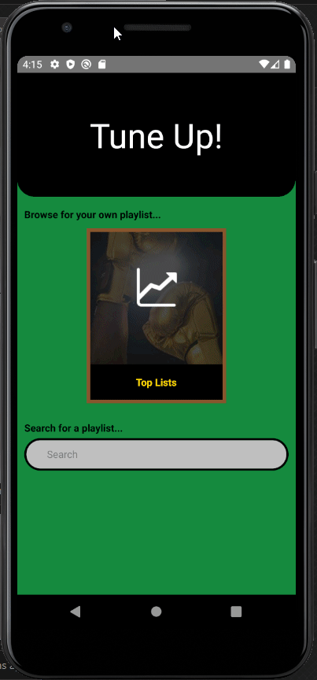

# TuneUp
TuneUp is a React Native based mobile game, challenging players of how well they really know their music.

Players can pick any arbitrary Spotify playlist, and will be quizzed on the name of a song picked at random, given a short 30-second snippet of the track.

# Server
TuneUp uses a backend server [TuneUpApi](https://github.com/masonc08/TuneUpApi), currently hosted on AWS EC2.

# Demo
https://youtu.be/31Xd8P0Mjxg

